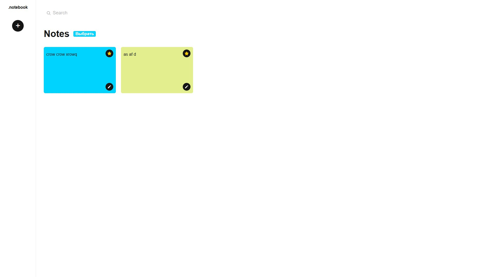

# To-Do Application with React Router and Context API

Это приложение списка дел, в котором можно добавлять задачи, изменять их важность, искать задачи по описанию, а также удалять выбранные задачи.

## Функциональность

- **Добавление задач**: Возможность добавлять новые задачи в список.
- **Изменение важности**: Изменение статуса важности задачи.
- **Поиск по описанию**: Поле ввода для поиска задач, переводящее на страницу `/search/:query`, где отображается список найденных задач.
- **Удаление задач**: Клик по кнопке выбора переводит приложение в режим выбора задач, после чего можно удалить отмеченные задачи.
- **Изменение статуса задачи**: При двойном клике по задаче её статус изменяется.

## Скриншоты

### Главная страница


### Страница поиска


## Установка и запуск

Чтобы запустить проект локально, выполните следующие команды:

1. Клонируйте репозиторий:
    ```bash
    git clone https://github.com/blinklay/todo-router.git
    cd todo-router
    ```

2. Установите зависимости:
    ```bash
    npm install
    ```

3. Запустите приложение:
    ```bash
    npm run dev
    ```

4. Запустите JSON-сервер с задержкой:
    ```bash
    json-server --watch src/db.json --delay 1100
    ```

